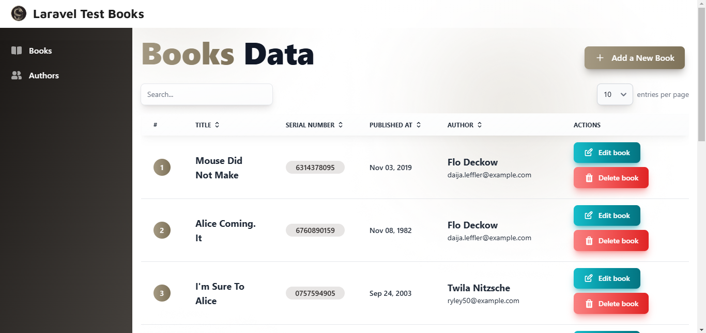

# Laravel Test Books Project



## Overview 🌟
This project was created by **Muhammad Falah Abdurrafi** (falahabdurrafi@gmail.com) as part of a technical test for Nine Dragon Labs. The task involves building a simple CRUD application using **Laravel 10** with the following database structure:

### Database Tables 🗃️
#### Authors Table
| Column Name  | Data Type |
| ------------ | --------- |
| `id`         | Integer   |
| `name`       | String    |
| `email`      | String    |
| `created_at` | Timestamp |
| `updated_at` | Timestamp |

#### Books Table
| Column Name     | Data Type |
| --------------- | --------- |
| `id`            | Integer   |
| `title`         | String    |
| `serial_number` | String    |
| `published_at`  | Date      |
| `author_id`     | Integer   |
| `created_at`    | Timestamp |
| `updated_at`    | Timestamp |

## Technologies Used 💻
- **Backend**: Laravel 10 
- **Frontend**: JavaScript, Tailwind CSS, Flowbite (v2.5.2) 
- **Tables**: Datatables for enhanced table display 

## Getting Started 🚀

### Prerequisites
Ensure you have the following installed:
- PHP >= 8.1
- Composer
- Node.js and npm

### Installation Steps

#### 1. Clone the Repository:
   ```bash
   git clone https://github.com/falahrafi/laravel-test-books

   cd laravel-test-books
   ```

#### 2. Install Composer Dependencies:
   ```bash
   composer install
   ```

#### 3. Install Node Modules:
   ```bash
   npm install
   ```

#### 4. Set Up Environment Variables:
   ```bash
   cp .env.example .env
   php artisan key:generate
   ```

#### 5. Run Database Migrations and Seeding:
   ```bash
   php artisan migrate:fresh --seed
   ```

#### 6. Run the Development Server:
   ```bash
   php artisan serve
   npm run dev
   ```
